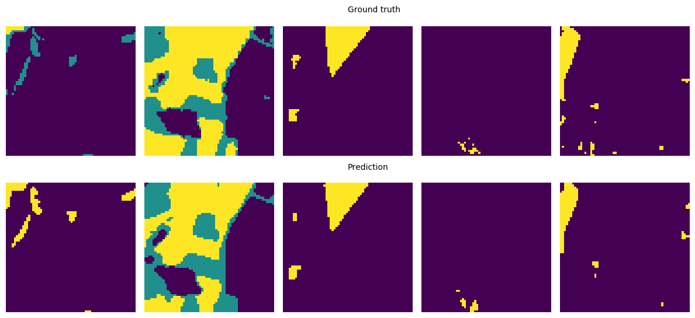
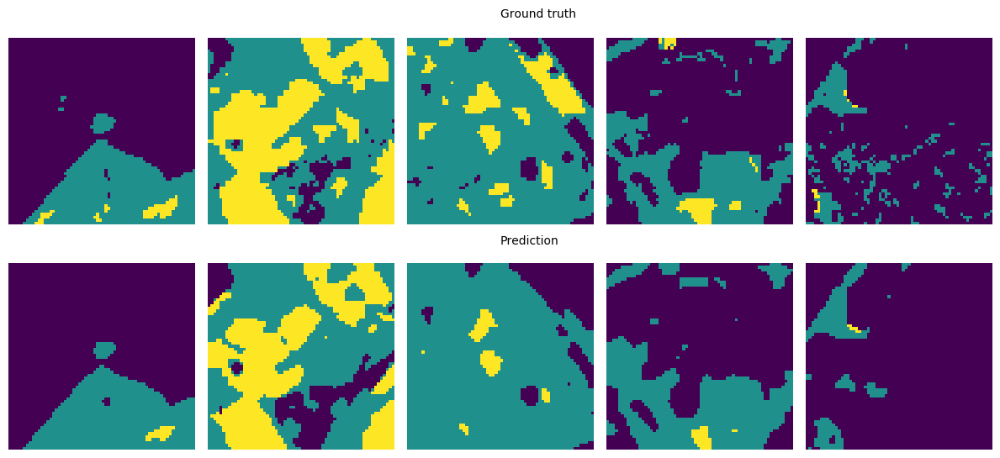
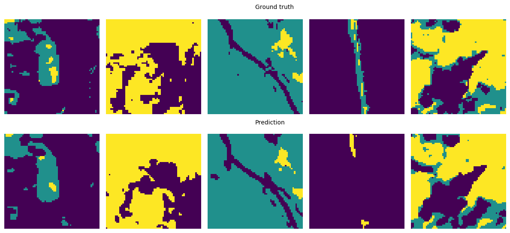

# Satellite Image Segmentation

**Goal**: To study the differences between using multispectral and RGB channels for satellite image segmentation.





## Install requirements

```python
pip install requirements.txt
```

## Training

```python
python train.py --session-name rgb --channels rgb --epochs 100
```

## Evaluate

```python
python evaluate.py --channels rgb --model output/rgb/models/best.pth
```

